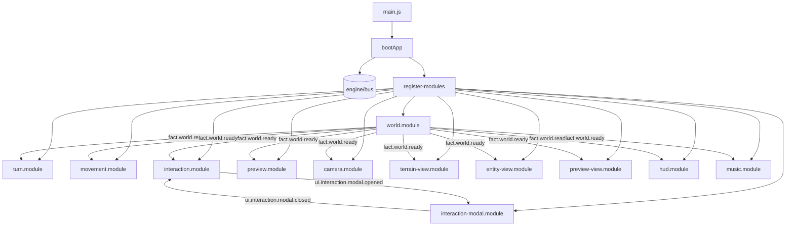
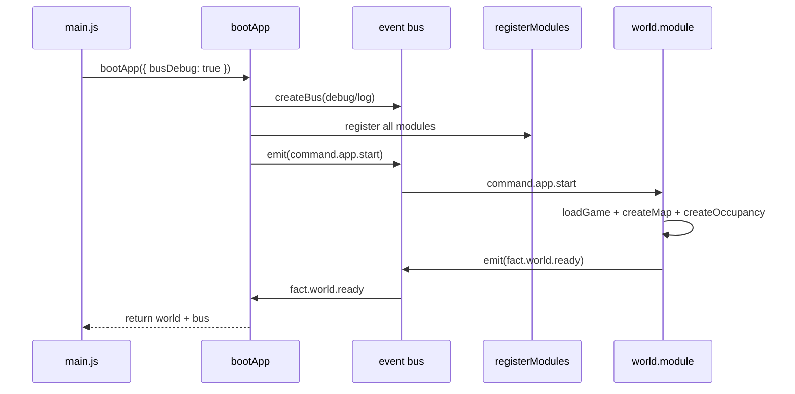
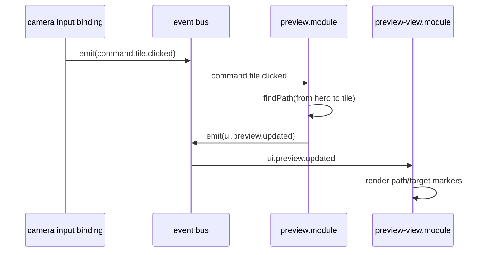
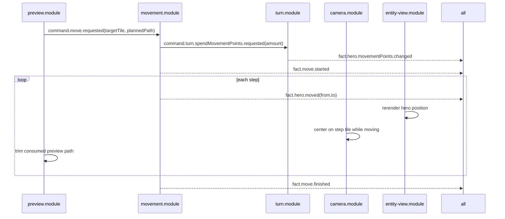

# Runtime Architecture (Bus-First Modules)

This document explains how the current runtime works on `main`.

It focuses on implementation structure and event flow. For gameplay requirements and acceptance behavior, see `docs/v1/SPEC.md`.

## 1) Architecture goals

The runtime is intentionally built around a few strict constraints:

- `bootApp` is minimal composition only; no feature logic.
- cross-module communication happens through the event bus, not direct imports/calls.
- each module owns its DOM querying, event subscriptions, internal state, and side effects.
- modules can use `engine/*` and `game/*`, but do not call each other directly.
- the `engine/` boundary remains strict: engine code never imports from `game/`.

This keeps feature behavior isolated, testable, and easier to extend without rewriting the bootstrap layer.

## 2) Runtime file map

Current runtime entry points:

```text
main.js
app/
  boot-app.js
  events.js
  modules/
    register-modules.js
    world.module.js
    turn.module.js
    movement.module.js
    interaction.module.js
    preview.module.js
    camera.module.js
    terrain-view.module.js
    entity-view.module.js
    preview-view.module.js
    interaction-modal.module.js
    hud.module.js
    music.module.js
    dev/bus-dev-panel.js
    shared/tile-utils.js
  ui/
    interaction-modal.element.js
```

## 3) Top-level architecture



## 4) Core contracts

### 4.1 Event bus contract (`engine/bus.js`)

The bus exposes:

- `addEventListener(type, handler)`
- `removeEventListener(type, handler)`
- `removeAllEventListeners(type?)`
- `getListenerCount(type?)`
- `emit(type, detail)`

Debug mode (`createBus({ debug: true, log })`) reports structured entries for:

- subscribe / unsubscribe / remove-all actions
- emit actions with subscriber counts

### 4.2 Event taxonomy (`app/events.js`)

Event names follow prefixes:

- `command.*` = intent/request (`command.move.requested`, `command.turn.end.requested`)
- `fact.*` = domain truth/state transition (`fact.hero.moved`, `fact.turn.ended`)
- `ui.*` = presentation state updates (`ui.preview.updated`, `ui.music.state.changed`)

### 4.3 Module registration contract

Every runtime module follows this shape:

- primary API: `registerXModule({ bus, env, config }, overrides?)`
- module registers all its own bus listeners
- module queries its own DOM dependencies via `env.document`
- `overrides` are optional test seams for module unit tests

`registerModules` wires modules exactly once from `bootApp`.

## 5) Boot lifecycle

`bootApp` in `app/boot-app.js` is now composition + startup orchestration only.

High-level steps:

1. build optional bus dev panel when `busDebug` is enabled.
2. create bus (`createBus`) unless one is injected.
3. compose `env` (`fetch`, `document`, `window`, `AudioCtor`).
4. compose `config` (defaults + overrides).
5. register all modules through `registerModules`.
6. emit `command.app.start`.
7. await either:
   - `fact.world.ready` -> resolve boot and return `{ scenario, definitions, map, occupancy, bus }`
   - `fact.world.load.failed` -> reject boot



## 6) Module responsibilities

Quick matrix:

| Module | Subscribes | Emits | Owns mutable state | Owns DOM |
|---|---|---|---|---|
| `world.module` | `command.app.start` | `fact.world.ready`, `fact.world.load.failed` | `hasStarted` | none |
| `turn.module` | `fact.world.ready`, `fact.move.started`, `fact.move.finished`, `command.turn.spendMovementPoints.requested`, `command.turn.end.requested` | `fact.hero.movementPoints.changed`, `fact.turn.ended` | `turnSystem`, `isMoving` | none |
| `movement.module` | `fact.world.ready`, `fact.hero.movementPoints.changed`, `command.move.requested` | `command.turn.spendMovementPoints.requested`, `fact.move.started`, `fact.hero.moved`, `fact.move.finished` | `movement`, `remainingMovementPoints`, `isMoveCommandInProgress` | none |
| `interaction.module` | `fact.world.ready`, `fact.move.finished`, `ui.interaction.modal.closed` | `ui.interaction.modal.opened`, `fact.monster.defeated` | `hero`, `interactions`, `pendingMonsterDefeat` | none |
| `preview.module` | `fact.world.ready`, `fact.hero.movementPoints.changed`, `command.tile.clicked`, `fact.move.started`, `fact.hero.moved`, `fact.move.finished`, `ui.interaction.modal.opened`, `ui.interaction.modal.closed` | `ui.preview.updated`, `command.move.requested` | `map`, `occupancy`, `hero`, `previewPath`, `previewTarget`, `isMoving`, `isInteractionModalOpen`, `remainingMovementPoints` | none |
| `camera.module` | `fact.world.ready`, `command.camera.panBy`, `fact.move.started`, `fact.hero.moved`, `fact.move.finished` | `command.camera.panBy`, `command.tile.clicked` | `camera`, `hero`, `map`, `isMoving` | queries `.viewport`, `.world` |
| `terrain-view.module` | `fact.world.ready` | none | none | queries `.terrain-layer` |
| `entity-view.module` | `fact.world.ready`, `fact.hero.moved`, `fact.monster.defeated` | none | `map`, `entities` | queries `.entity-layer` |
| `preview-view.module` | `fact.world.ready`, `ui.preview.updated` | none | `map` | queries `.effects-layer` |
| `interaction-modal.module` | `ui.interaction.modal.opened` | `ui.interaction.modal.closed` | `activeModal` | queries `.viewport`; mounts custom element |
| `hud.module` | `fact.hero.movementPoints.changed`, `ui.music.state.changed`, `fact.world.ready` | `command.turn.end.requested`, `command.music.toggle.requested` | none | queries `.ui-layer`, `#movement-points-status`, `#end-turn-button`, `#music-toggle-button`, `#boot-status` |
| `music.module` | `fact.world.ready`, `command.music.toggle.requested` | `ui.music.state.changed` | `musicPlayer`, `hasInitialized` | none |

### 6.1 Domain-first vs view modules

Runtime modules are intentionally split into two categories:

- domain/control modules: `world`, `turn`, `movement`, `interaction`, `preview`, `camera`, `music`
- view/projection modules: `terrain-view`, `entity-view`, `preview-view`, `interaction-modal`, `hud`

`register-modules.js` registers domain modules first, then view modules, which keeps event flow intuitive and avoids a bootstrap god-object.

### 6.2 Reusable UI components (custom elements)

For complex, reusable UI surfaces (like interaction dialogs), the runtime uses custom elements under `app/ui/`.

Current example:

- `app/ui/interaction-modal.element.js` defines `<interaction-modal>` and owns:
  - internal template structure (title/message/actions)
  - open/close transitions
  - modal-local keyboard/click handling

Why this pattern is used:

- keeps bus modules orchestration-focused (event in -> event out), not template-heavy
- centralizes modal behavior in one place for future interactions (resources/towns/multi-action dialogs)
- makes UI behavior testable directly with component-level tests (`app/ui/*.test.js`)

How to use going forward:

1. create/extend component API (`open(payload)`, `close()`, custom close event).
2. keep the module as controller (listen to bus, mount component, translate component events back to bus).
3. avoid direct domain logic in the component; domain stays in `game/systems/*` + domain modules.
4. keep selectors owned by component internals; callers should not depend on component internals unless tests require it.

## 7) Important end-to-end flows

### 7.1 Tile click -> preview update (first click)



### 7.2 Confirmed movement (second click same tile)



### 7.3 End turn during movement

- `hud.module` emits `command.turn.end.requested` when button is clicked.
- `turn.module` ignores this command while `isMoving === true`.
- `isMoving` is derived only from bus facts:
  - set `true` on `fact.move.started`
  - set `false` on `fact.move.finished`

This ensures end-turn cannot race movement completion.

### 7.4 Partial movement and remainder preview

- `movement-system` caps executed steps to remaining movement points.
- each executed step emits `fact.hero.moved`.
- `preview.module` progressively trims path on each move fact.
- after `fact.move.finished`:
  - if target is not reached, remaining route stays previewed (red over-limit segment support via `maxAffordableSteps`)
  - if target is reached, preview clears

This is the canonical behavior for long routes in the current runtime.

### 7.5 Music toggle

- on `fact.world.ready`, `music.module` lazily initializes player and emits initial `ui.music.state.changed`.
- on `command.music.toggle.requested`, module toggles player and emits updated UI state.
- `hud.module` is the single owner of music button label and `aria-pressed` rendering.

### 7.6 Monster combat -> modal -> deferred removal

- `movement-system` stops hero one tile before an attacked monster, spends the move cost, and marks `fact.move.finished` with `interaction.kind = MONSTER_COMBAT`.
- `interaction.module` resolves combat from move-finished context and emits `ui.interaction.modal.opened`.
- `interaction-modal.module` mounts `<interaction-modal>` in `.viewport`.
- closing the modal emits `ui.interaction.modal.closed`.
- after close, `interaction.module` runs monster fade-out and only then emits `fact.monster.defeated`.
- `entity-view.module` rerenders from world state on `fact.monster.defeated`.

## 8) DOM ownership map

Each module owns the selectors it queries and updates:

- `camera.module`: `.viewport`, `.world` (camera movement and click-to-tile input binding)
- `terrain-view.module`: `.terrain-layer` (terrain render)
- `entity-view.module`: `.entity-layer` (entity render)
- `preview-view.module`: `.effects-layer` (path preview svg render)
- `interaction-modal.module`: `.viewport` (mount/unmount custom modal element)
- `hud.module`:
  - `.ui-layer` (stop propagation)
  - `#movement-points-status` (MP text)
  - `#end-turn-button` (end-turn command source)
  - `#music-toggle-button` (music command source + UI state)
  - `#boot-status` (boot status text)
- `boot-app.js`: no feature DOM ownership; only optional bus dev panel composition

`<interaction-modal>` owns its internal dialog DOM and interaction handlers; other modules interact with it through its public API and close event.

## 9) Debug observability

With `bootApp({ busDebug: true })`:

- `engine/bus` emits debug entries containing action/type/detail/subscriber count.
- `app/modules/dev/bus-dev-panel.js` renders a collapsible event stream.
- panel behavior:
  - hidden by default
  - toggle button shows event count
  - per-entry kind badge (`command`, `fact`, `ui`, `other`)
  - subscriber count (`subs: N`) for each emitted event

Panel styles are in `game/ui/bus-dev-panel.css`.

## 10) Testing strategy and seams

### 10.1 Module unit tests

Each module has a focused unit test file under `app/modules/*.test.js`.

Test seams are explicit and local:

- module-level overrides (second argument) for dependencies like `createMovementSystem`, `createCamera`, `loadMusicTracks`
- fake bus (`tests/test-utils/fake-bus.js`) to assert emitted events and listener behavior

### 10.3 UI component tests

Reusable custom elements are tested directly under `app/ui/*.test.js`.

For `interaction-modal` this includes:

- payload rendering (`title`, `message`)
- close mechanics (OK click, Escape, transition delay)
- event emission contract (`interaction-modal-closed`)

### 10.2 Behavior tests

End-to-end behavior scenarios live in `tests/behavior/*` and boot the real module graph.

Important deterministic controls used by tests:

- `config.movementStepDelayMs`
- `config.movementSleep`

These allow movement timing to be deterministic without reintroducing boot-level dependency wiring.

## 11) Extension playbook (how to add a feature safely)

1. define new events in `app/events.js` using the `command.*` / `fact.*` / `ui.*` naming scheme.
2. implement feature logic in a single module (or a small set of modules) under `app/modules/`.
3. keep communication bus-first; do not call another module directly.
4. if DOM is involved, decide between:
   - module-owned direct DOM (simple projections), or
   - custom element under `app/ui/` (reusable/interactive UI).
5. if using a custom element, keep module as bus/controller layer and component as UI implementation.
6. register module from `app/modules/register-modules.js`.
7. add/expand module and component tests first, then behavior tests.

## 12) Invariants to keep

When editing architecture, preserve these invariants:

- `bootApp` stays composition/startup only.
- no `deps` god-object passed from boot into feature logic.
- no module-to-module direct calls for runtime behavior.
- bus events are the only cross-module coordination channel.
- `engine/` never imports from `game/`.
- module tests validate module internals; behavior tests validate user-observable flows.
